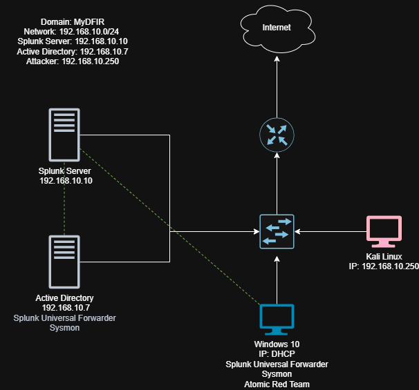
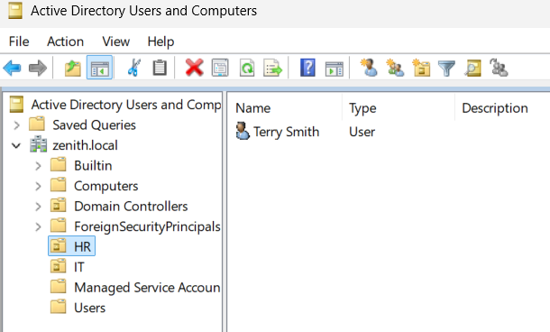
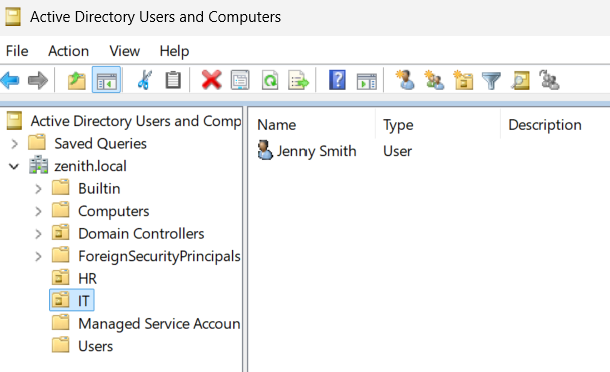
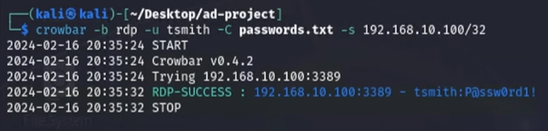
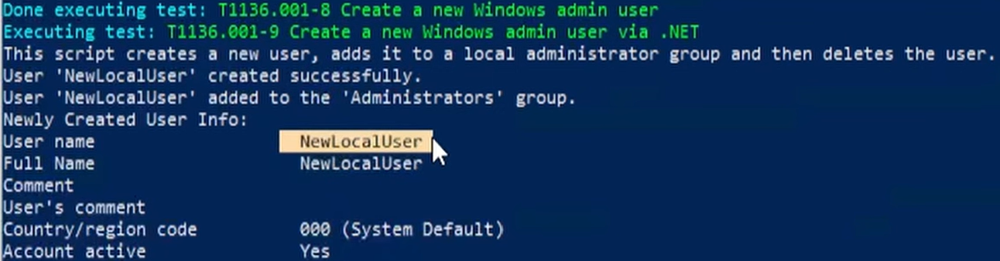

# Active Directory Home Lab: Attack & Detection with Splunk

## Project Objective
The goal of this project was to establish a controlled corporate network environment to simulate real-world cyber attacks and analyze resulting telemetry within a SIEM. By configuring a **Windows Domain Controller**, executing a **Brute Force attack**, and utilizing the **Atomic Red Team (ART)** framework, I gained hands-on experience in log correlation, DNS management, and threat detection engineering.

## Tools & Technologies
* **Virtualization:** Oracle VirtualBox
* **SIEM:** Splunk Enterprise (Log Ingestion & Analysis)
* **Directory Services:** Windows Server 2025 (Active Directory / Domain Controller)
* **Attacker OS:** Kali Linux (Crowbar, RockYou.txt)
* **Endpoints:** Windows 10 (Target Workstation)
* **Automation/Testing:** Atomic Red Team (Telemetry Generation)

---

## Lab Architecture


> **Network Diagram**
> 

---

## Step-by-Step Implementation

### 1. Environment Setup & AD Configuration
I deployed four virtual machines in an isolated internal network to simulate a corporate subnet.
* **Windows Server:** Promoted to a Domain Controller (DC). I established a mock corporate hierarchy using **Organizational Units (OUs)** and populated them with test users.
* **Windows 10 Target:** Joined to the domain. **Crucial Step:** I manually configured the Target VM's DNS settings to point directly to the DC's static IP. Without this, the workstation would fail to resolve the domain and authentication would break.

I organized the `zenith.local` domain into functional Organizational Units (OUs) to simulate a realistic corporate hierarchy. This allows for granular application of Group Policy Objects (GPOs) and better tracking of department-specific telemetry.

> **HR OU:**
> 

> **IT OU:**
> 

---

### 2. Attacking the Domain (Brute Force)
Using **Kali Linux**, I launched an automated brute-force attack against the Windows 10 workstation to simulate a credential-guessing scenario.
* **Tool:** Crowbar
* **Wordlist:** `rockyou.txt`

**Targeting user Terry Smith**
```bash
# Command used for RDP brute force:
crowbar -b rdp -u tsmith -C passwords.txt -s 192.168.10.100/32
```

> **Kali Attack Terminal**
> 

**Telemetry Generated**
> **Splunk**
> ```spl
> index=endpoint tsmith
> ```
>
> **Checking Event Codes**
> 

### 3. Telemetry Generation (Atomic Red Team)

To validate my detection capabilities, I installed Atomic Red Team (ART) on the target machine. This allowed me to execute "Atomics" mapped to the MITRE ATT&CK matrix, generating high-fidelity logs for analysis.

**Example Atomic Test**
```powershell
Invoke-AtomicTest T1136.001
```

> **ART Execution**
> 
> 
### 4. SIEM Analysis in Splunk

Once telemetry was ingested via the Splunk Universal Forwarder, I performed targeted searches to identify Indicators of Compromise (IoCs). I specifically investigated local account creation—a primary tactic for maintaining persistence.

**Search Query:**
```spl
index=endpoint NewLocalUser
```

> **Splunk Search Results**

# Lessons Learned

- DNS Dependency: Active Directory is entirely dependent on DNS; misconfigured DNS is the most common reason for domain-join failures.

- Visibility Gaps: Logs do not appear in Splunk automatically. I learned to configure Windows Event Forwarding and fine-tune Group Policy Objects (GPOs) to ensure the right security events were being generated.

- Detection Engineering: Using Atomic Red Team proved that effective security is a cycle of testing, detecting, and refining queries.

# Contact & Links

- LinkedIn: [Your LinkedIn Link]

- GitHub: [Your GitHub Profile Link]

